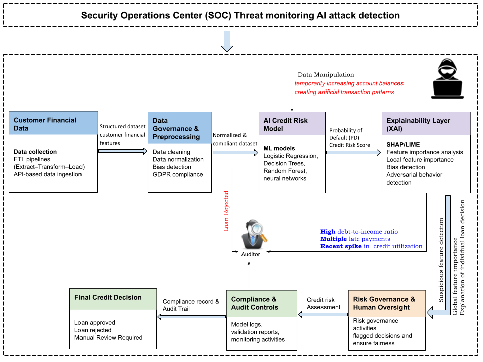
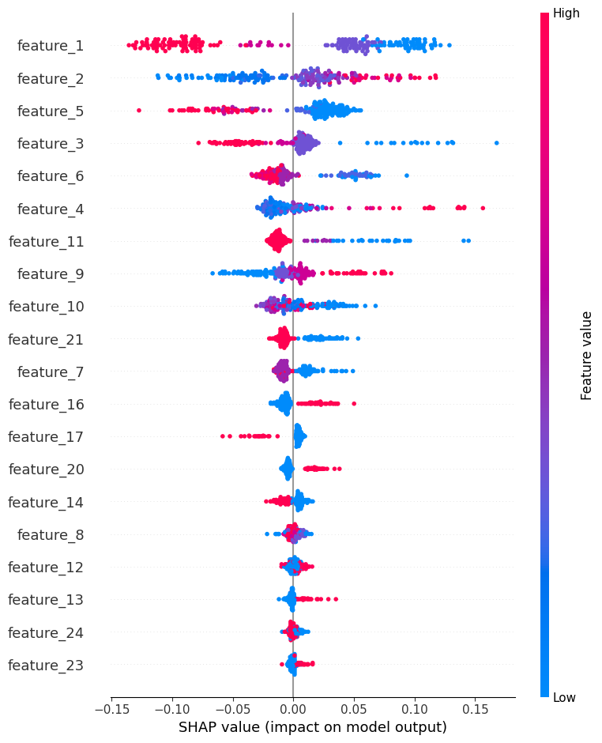
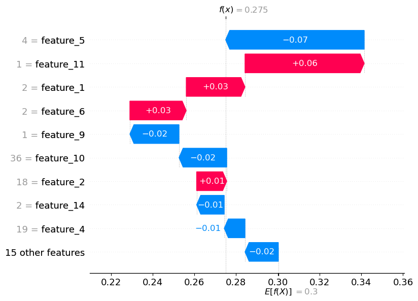
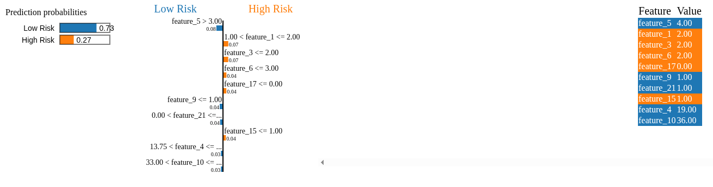

# Explainable AI Governance for Credit Risk (EU AI Act Perspective)

## Overview

This project demonstrates a practical **AI governance prototype for credit risk assessment** in financial services. It integrates machine learning, explainable AI (XAI), auditability, and monitoring to simulate how AI-driven decisions can be made transparent and compliant with regulatory expectations such as the **EU AI Act**.

The project goes beyond model development by incorporating governance mechanisms that support **transparency, accountability, and traceability** in AI systems.

## AI Governance Architecture

The following architecture illustrates how AI-driven credit risk systems can be designed to meet governance, explainability, and auditability requirements.



The system follows a governance-driven pipeline:

**Customer Data → Data Governance → AI Model → Explainability → Governance Review → Audit → Monitoring → Decision**

This architecture ensures that AI decisions are not only accurate but also explainable and auditable.

## Project Demo

This project demonstrates:

- AI-driven credit risk prediction  
- Explainable AI using SHAP and LIME  
- Governance workflow including audit logging and monitoring  

Below are example outputs from the system:

## Explainability Outputs

### SHAP Global Feature Importance


### SHAP Local Explanation


### LIME Local Explanation


## Decision Explanation: Loan Approval / Rejection

This project simulates how a bank can make and justify AI-driven credit decisions.

### Example Scenario

A customer applies for a loan. The AI system processes the applicant’s financial data and predicts the credit risk:

- `0` → Low Risk (Loan Approved)
- `1` → High Risk (Loan Rejected)

### Model Decision

The Random Forest model evaluates the customer’s financial profile and predicts the probability of default.

Example:

- Predicted Risk: **High Risk**
- Decision: **Loan Rejected**

### Explainability (Why the decision was made)

Using SHAP and LIME, the system explains the decision:

- Certain features increase risk (e.g., high credit amount, long duration)
- Other features may reduce risk

These explanations provide transparency into how the model reached its decision.

### Customer Perspective

The bank can communicate:

> “Your loan application was declined due to factors such as high credit exposure and repayment risk indicators identified by the model.”

### Auditor / Regulator Perspective

The system supports auditability through:

- SHAP explanations showing feature contributions
- LIME explanations for individual decisions
- Audit logs containing prediction details and timestamps
- Governance reports documenting model performance and behavior

This ensures that decisions are:

- Transparent  
- Explainable  
- Traceable  

and aligned with regulatory expectations such as the EU AI Act.

## Objectives

This project demonstrates how to:

- Build AI models for credit risk prediction
- Compare interpretable and black-box models
- Apply SHAP and LIME for model explainability
- Enable governance through performance evaluation
- Maintain audit logs for traceability
- Monitor model behavior for anomalies

## Machine Learning Models

### Logistic Regression
- Interpretable baseline model  
- Provides transparency through model coefficients  

### Random Forest
- Higher predictive performance  
- Black-box model requiring explainability  

## Explainable AI Techniques

### SHAP (SHapley Additive Explanations)
- Explains feature contributions globally and locally  
- Helps validate model behavior  

### LIME (Local Interpretable Model-Agnostic Explanations)
- Explains individual predictions  
- Useful for case-level analysis  

## Governance Features

The system includes governance-oriented components:

- Data quality checks (missing values, duplicates)
- Model performance comparison
- Governance report for review
- Audit logging of predictions
- Monitoring for unusual model behavior

## Dataset

The project uses the **German Credit dataset**, a benchmark dataset widely used in financial risk modeling.

Target variable:

- `0` → Low risk  
- `1` → High risk (default)

## Project Structure

```text
## Project Structure

```text
credit-ai-governance/
│
├── data/
│   ├── german.data
│   ├── german.data-numeric
│   └── german_credit.csv
│
├── outputs/
│   ├── shap_summary.png
│   ├── shap_local_explanation.png
│   ├── lime_explanation.html
│   ├── lime_screenshot.png
│   ├── ai_governance_architecture.png
│   ├── model_metrics.csv
│   ├── governance_report.txt
│   ├── audit_log.csv
│   └── monitoring_alerts.txt
│
├── src/
│   ├── preprocess.py
│   ├── train_models.py
│   ├── explain_shap.py
│   ├── explain_lime.py
│   ├── governance_checks.py
│   ├── audit_log.py
│   └── monitor.py
│
├── prepare_data.py
├── main.py
├── requirements.txt
├── credit_ai_governance_demo.ipynb
├── .gitignore
└── README.md

## Installation

Install dependencies:

pip3 install -r requirements.txt

---

## Run the Project

Run the full pipeline:

python3 prepare_data.py
python3 main.py

---

## Key Insights

- Random Forest achieved better predictive performance  
- Explainability is essential for black-box models  
- Governance enables transparency and compliance  
- Monitoring helps detect anomalies and risks  
